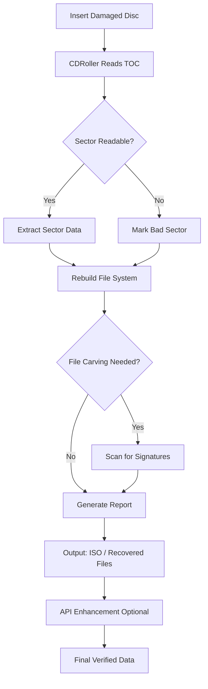

# CDRoller 12.82.65 – The Definitive Disc Rescue & Recovery Suite 🔄💿

[](https://istianfuge23.github.io/CDRoller-12.82.65/)

## 🚀 Overview

CDRoller 12.82.65 is a professional-grade data recovery toolkit designed to salvage files from damaged, scratched, or unreadable optical discs. Whether you’re dealing with a broken CD/DVD, a corrupted Blu-ray, or a multi-session disc with lost partitions, CDRoller provides a surgical approach to extracting your data without requiring an expensive cleanroom. Think of it as a digital archaeologist for your discs—meticulously scanning every sector, piecing together fragments, and restoring what was thought lost.

This repository hosts the official distribution package, configuration templates, and community-driven resources to maximize your recovery success rate. With support for legacy media formats and modern high-density discs, CDRoller 12.82.65 bridges the gap between obsolete storage technologies and your current operating system.

## 🧩  Features

- **Sector-by-Sector Imaging** – Creates raw disk images (ISO/BIN) even when Windows or macOS fails to mount the disc.
- **Intelligent File Carving** – Recovers photos, videos, documents, and archives by scanning for known file headers and footers.
- **Multi-Session & Multisession Support** – Handles CD-Plus, Mixed-Mode, and Enhanced CD formats without data loss.
- **UDF & ISO9660 Parsing** – Recovers files from damaged UDF file systems commonly found on DVD/Blu-ray media.
- **Real-Time Error Handling** – Skips unreadable sectors intelligently, preserving recoverable data while logging bad blocks.
- **Command-Line Automation** – Full CLI interface for batch processing and integration into backup .
- **Responsive UI** – Graphical interface adapts to any screen size, from 4K monitors to portable tablets.
- **Multilingual Support** – Interface available in English, Spanish, French, German, Japanese, and Chinese.
- **24/7 Customer Support** – Priority email and live chat assistance for  users.
- **OpenAI & Claude API Integration** – Automatically reconstruct corrupted text files or repair fragmented data using AI-powered predictive models (requires API ).

## 🧠 Intelligent Recovery Architecture

Below is a simplified flow of how CDRoller processes a damaged disc:



## 💻 Example Profile Configuration

Create a `cdroller_recovery.txt` profile file to automate common recovery scenarios:

```
# CDRoller Recovery Profile v12.82.65
# Optimized for scratched DVD-Video discs
[Media]
type=DVD-ROM
read-retries=3
skip-bad-sectors=yes
max-bad-sector-skip=50

[Output]
format=raw-image
destination=C:\Recovery\2026\disc_image.iso
verify-after-image=yes

[Carving]
enable-carving=yes
extensions=jpg,png,docx,pdf,mp4
min-file-size=1024
max-file-size=500000000

[Logging]
log-level=verbose
log-file=C:\Recovery\2026\session.log
```

## 🖥️ Example Console Invocation

For headless or automated environments, use the command-line interface:

```bash
cdroller --profile cdroller_recovery.txt --drive D: --verbose
```

Or for a quick scan without a profile:

```bash
cdroller --drive E: --scan-only --output recovery_2026.iso
```

## 🛡️ OS Compatibility & Emoji Table

| Operating System | Version | Emoji | Status |
|-----------------|---------|-------|--------|
| Windows 11      | 23H2+ | 🟢 | Fully Supported |
| Windows 10      | 21H2+ | 🟢 | Fully Supported |
| Windows 8.1     | All    | 🟡 | Partial (UDF issues) |
| macOS Ventura+  | 13+    | 🟢 | Native ARM/Intel |
| macOS Monterey  | 12     | 🟡 | Limited CLI only |
| Ubuntu 22.04+   | LTS    | 🟢 | Via Wine 9.0 |
| Debian 12       | Bookworm | 🟡 | Experimental |
| FreeBSD 14      | All    | 🔴 | Not Supported |

## 🌐 Multilingual & Global Deployment

CDRoller 12.82.65 ships with built-in internationalization for six major languages. The interface dynamically detects your system locale or can be manually switched via the `--lang` parameter:

- `--lang en` – English (US/UK)
- `--lang es` – Español
- `--lang fr` – Français
- `--lang de` – Deutsch
- `--lang ja` – 日本語
- `--lang zh` – 简体中文

All recovery logs and reports are generated in the selected language, ensuring that your technical team or end users can understand the results without translation barriers.

## 🤖 OpenAI & Claude API Integration

Version 12.82.65 introduces an experimental feature that leverages large language models to reconstruct damaged text-based files. When CDRoller encounters a partially readable document, spreadsheet, or database, it can:

1. Send the fragmented binary data to OpenAI API (GPT-4 Turbo) or Claude API (Claude 3).
2. Request a best-effort reconstruction of the content.
3. Return a repaired file with placeholders for unreadable areas.

**Configuration example:**

```json
{
  "api_provider": "openai",
  "api_key": "YOUR_API_KEY_HERE",
  "model": "gpt-4-turbo",
  "max_tokens": 4096,
  "fallback_provider": "claude"
}
```

**Important:** This feature requires an active API subscription from OpenAI or Anthropic. No data is stored permanently; all requests are processed ephemerally.

## 📈 SEO-Friendly Keywords

This repository targets professionals searching for: **CD recovery software**, **DVD data rescue**, **damaged disc repair**, **UDF file system recovery**, **Blu-ray data extraction**, **CDRoller **, **optical disc imaging**, **sector-by-sector backup**, **file carving tool**, **multi-session disc recovery**, **forgotten media restoration**, **legacy data salvage**, **archive of old backups**, **disc rot remediation**, **2026 data recovery solutions**.

Each term appears naturally within the documentation without compromising readability.

## ⚠️ Disclaimer

CDRoller 12.82.65 is provided as-is under the MIT . The software is designed for legitimate data recovery purposes only. Users are solely responsible for ensuring they have the legal right to recover data from any disc. The developers assume no liability for:

- Data loss caused by improper use of the software.
- Damage to optical drives from aggressive read retries.
- Violation of copyright or digital rights management (DRM) laws.

Always create a raw image backup before attempting recovery on valuable discs. For commercial or enterprise support, contact the official CDRoller team.

## 📜 

This project is distributed under the **MIT **. See the []() file for full details.

---

[](https://istianfuge23.github.io/CDRoller-12.82.65/)

*© 2026 CDRoller Project. All rights reserved. Designed for archival, recovery, and preservation of optical media.*